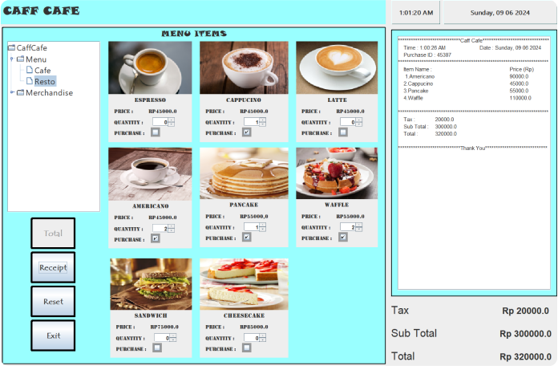

# Cafe Management System

The Cafe Management System is an Object-Oriented Programming (OOP) project developed in Java using NetBeans IDE. This system allows the administration of a cafe, including functionalities such as an admin login, menu management for drinks and food, price calculations, quantity management for each menu item, bill totalization, and receipt printing.



## Features

- **Admin Login:** Secure login page for the admin to access the system.
- **Menu Management:** A menu page for managing drinks and food items.
- **Price Calculation:** Calculation of prices based on the selected items and their quantities.
- **Quantity Management:** Manage the quantity of each menu item.
- **Bill Totalization:** Totalize the bill based on selected items and quantities.
- **Receipt Printing:** Generate and print receipts for customers.

## Installation

1. **Clone the repository:**

   ```bash
   git clone https://github.com/EvanescenT07/CafeManagementSystem.git

   ```

2. ## Open the project in NetBeans:

Launch NetBeans IDE.
Go to File > Open Project.
Select the cloned repository folder.

3. ## Build and run the project:
   Click on the Run button or press F6.

## Usage

Login:

- Use the admin credentials to log in.

Manage Menu:

- Navigate to the menu page to add, update, or delete items from the menu.

Calculate Price:

- Select the items and their quantities to calculate the total price.

Totalize Bill:

- View the total bill amount based on selected items and their quantities.

Print Receipt:

- Generate and print a receipt for the customer.

Contributing
If you would like to contribute to this project, please fork the repository and submit a pull request.

License
This project is licensed under the MIT License. See the LICENSE file for more details.

Contact
For any questions or inquiries, please contact me at zulfikar.aliansyah@student.president.ac.id.
